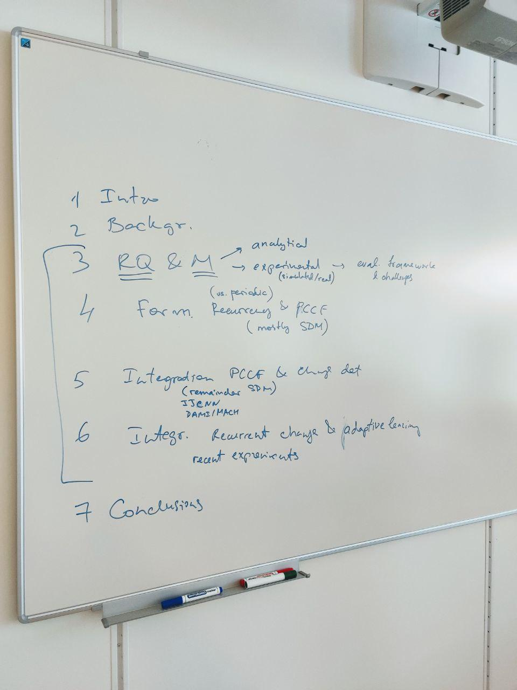
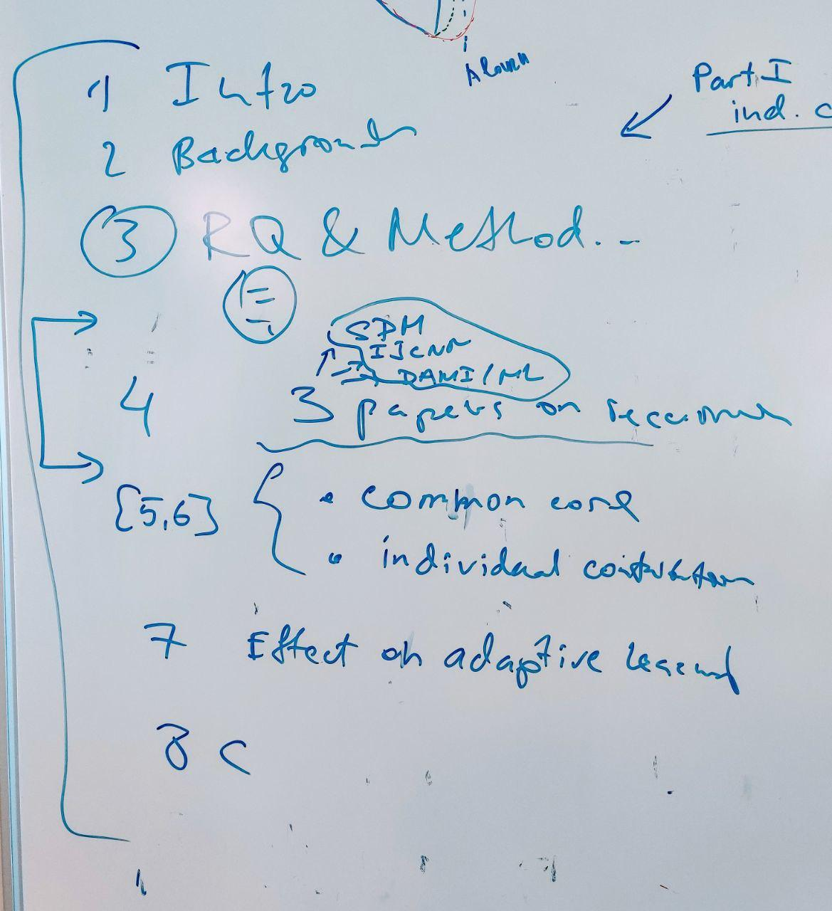

## Meeting 18 aug 2021

ch3 only current knowledge + what we study
ch3 ask question but answer is in corresponding chapter 

methodology show how one of the RQ is answered
feller + background 

simulation is very important ! 
maybe primary

Ground true for changes in the last dataset!

Methodology diagram.
Central circle is implementation, artifact development.
Make dashed arrows to the left bottom circle.

Do hierarchy of RQ with mappings to corresponding chapters.
Which RQs solved analytically and which are experimentally 
Mapping RQ to methodology 
Pccf is analytical and simulation.
Integration is done experimentally.

challenges,e.g. from souza 

* RQs
- how to formalaize recurrency
- how to integrate
- what is an effect on adaptive learning

Ch4 + sdm 
ch5 + other papers 

Pccf is not in background.

Write about chp and chp for adaptation in RQ.

## Meeting 11 Aug 2021

Maybe structure: Part 1 - individual chp Part 2: recurrency

- Now: Describe which datasets were used
- Finish: adaptation methods description based on Survey
- Add experiment with insects datasets, as for CFB 
- Now: Finnish first Chapter 3
- Check/ask colleaques: ACLAC - check if it was already used in someones thesis
- Later: how to deal with quantile and ACLAC (maybe future work/chapter, PELT - backtracking mechanism)
- Note: new experiments on model adaptation will support journal paper
- Now: Research methodology - methods - triangle
- Now: What is the common part for 3 papers?
- Done: In experiments use growing window size
- Maybe: maybe include ROI with MLP paper 
