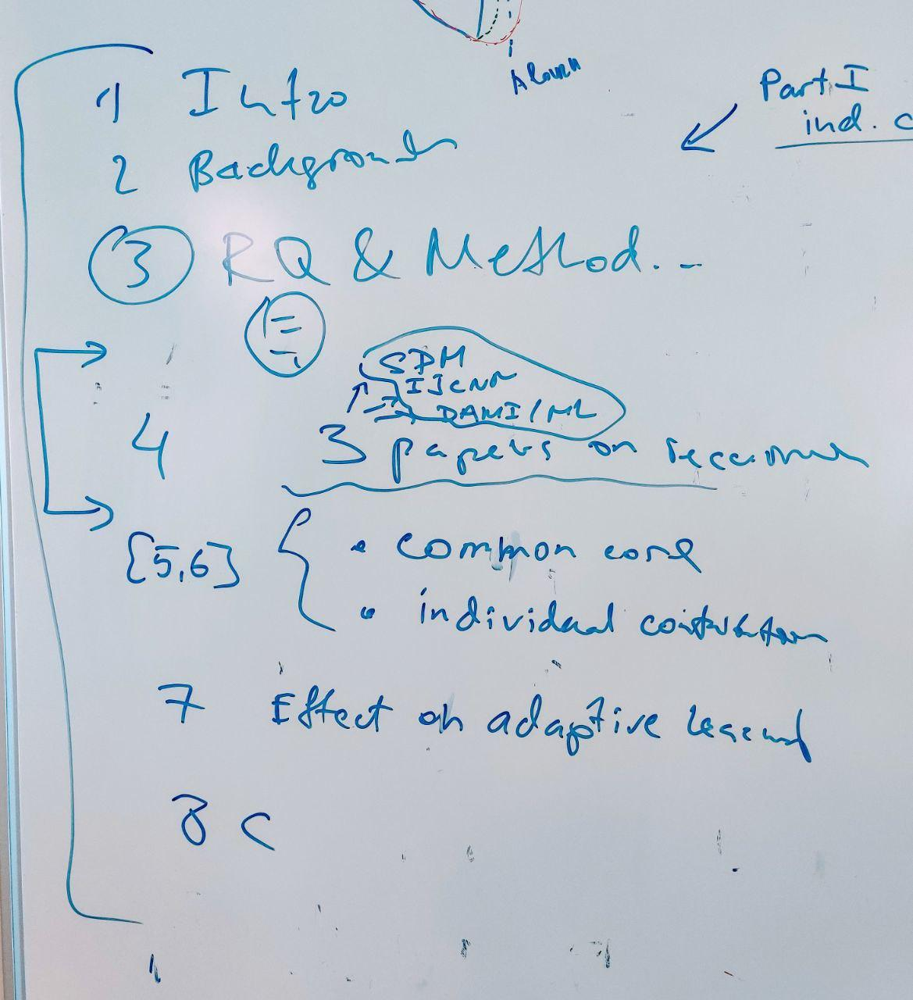

## Meeting 11 Aug 2021

Maybe structure: Part 1 - individual chp Part 2: recurrency

- Add experiment with insects datasets, as for CFB 
- Now: Finnish first Chapter 3
- Check/ask colleaques: ACLAC - check if it was already used in someones thesis
- Later: how to deal with quantile and ACLAC (maybe future work/chapter, PELT - backtracking mechanism)
- Note: new experiments on model adaptation will support journal paper
- Now: Research methodology - methods - triangle
- Now: What is the common part for 3 papers?
- Now: Add section with datasets; why different or same datasets?
- Done: In experiments use growing window size
- Maybe: maybe include ROI with MLP paper 
